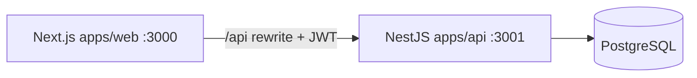

# KnowledgeHub

[](package.json)
[](package.json)

**KnowledgeHub** is the internal engineering learning platform for **TO THE NEW** (`@tothenew.com`). Employees discover and watch knowledge meets, series, and videos; track progress; search the catalog; and use an in-app AI assistant. Contributors and admins publish content through studio workflows and a full **Content Manager** (admin CMS).

---

## Project overview

| | |
|---|---|
| **Problem** | Fragmented engineering knowledge across recordings and drives |
| **Solution** | Central hub with RBAC, approvals, search, and Gemini-assisted discovery |
| **Users** | Learners (`USER`), contributors (`TEAM`), platform admins (`ADMIN`) |

Detailed context: [`docs/project-overview.md`](docs/project-overview.md).

---

## Business context

TO THE NEW runs recurring **Knowledge Meets** and **Knowledge Series** to share engineering practices. Recordings, slides, and metadata were hard to discover and reuse. KnowledgeHub centralizes that catalog with Google sign-in for employees, role-based publishing (**TEAM** / **ADMIN**), learner engagement (bookmarks, comments, Q&A, watch history), **Learning Journey** progress, search, and optional **KnowledgeHub AI** (Gemini) for discovery and summaries. The product is an internal learning hub — not IT support or ticketing.

---

## Architecture



- **Monorepo:** pnpm workspaces + Turbo
- **Flows:** [`architecture/`](architecture/) (auth, CMS, feeds, AI, media)
- **Decisions:** [`adr/`](adr/) (ADR-001–010)
- **Deep dive:** [`docs/architecture.md`](docs/architecture.md)

---

## Tech stack

| Layer | Technologies |
|-------|----------------|
| Web | Next.js 16, React 19, Ant Design 6, SCSS (Aspire), React Query, Zustand |
| API | NestJS 11, Prisma 6, Passport JWT, class-validator |
| Data | PostgreSQL 16; optional Elasticsearch 8 |
| AI | Google Gemini (`AI_PROVIDER=gemini`) |
| Infra | Docker Compose (Postgres + ES); S3/SMTP/Web Push via env adapters |

---

## Features

- Google OAuth (domain-restricted) and JWT sessions
- Home feed, explore, search, recommendations
- Video playback with resume, mini player, continue watching
- Knowledge meets (recorded) and knowledge series with episodes
- Comments, Q&A, bookmarks, library, progress summary
- Team studio, upload, series slot workflow
- Admin approvals, analytics, announcements, user roles
- Admin CMS (meets, series, speakers, competencies, resources, homepage metadata)
- KnowledgeHub AI (discover, video summary, quiz) when configured

Full inventory: [`docs/project-build-summary.md`](docs/project-build-summary.md).

---

## Screenshots

_Add screenshots of home, watch, and admin CMS to `docs/assets/` when capturing from staging; paths can be linked here._

---

## Folder structure

```
ttn-knowledge-hub/
├── apps/web/              # Next.js frontend
├── apps/api/              # NestJS API + prisma/
├── packages/types/        # Shared TypeScript contracts
├── packages/tsconfig/
├── docker/                # docker-compose.yml
├── docs/                  # Engineering documentation (index: docs/README.md)
├── architecture/          # Feature flow diagrams
├── adr/                   # Architecture decision records
├── roadmap/               # Status, backlog, releases
├── onboarding/            # New developer guides
├── ai/                    # AI module spec & prompts
├── .cursor/               # Cursor knowledge base + rules/
├── database/              # Assessment DB docs (setup, migrations, seed pointers)
├── ai-prompts/            # Prompt history by lifecycle phase
├── tool-specific/cursor-workflow/  # Cursor traceability (spec, tasks, rules)
├── candidate-info.md      # AI Capability Exercise — candidate metadata
├── requirements-analysis.md, acceptance-criteria.md, implementation-plan.md
├── design-notes.md, api-contract.md, data-model.md, ui-flow.md
├── test-strategy.md, test-results.md, debugging-notes.md
├── code-review-notes.md, review-fixes.md, reflection.md
├── tool-workflow.md, pr-description.md, final-ai-usage-summary.md
├── CONTRIBUTING.md
├── CHANGELOG.md
└── PROJECT_HEALTH.md
```

---

## Installation

### Prerequisites

- **Node.js** ≥ 20  
- **pnpm** 9.15.4 (`npx pnpm@9.15.4`)  
- **Docker** (PostgreSQL; optional Elasticsearch)

### Quick start

```bash
docker compose -f docker/docker-compose.yml up -d

cp apps/api/.env.example apps/api/.env
cp apps/web/.env.example apps/web/.env.local
# Edit JWT secrets and GOOGLE_CLIENT_ID in both files

npx pnpm@9.15.4 install
npx pnpm@9.15.4 db:migrate
npx pnpm@9.15.4 db:seed
npx pnpm@9.15.4 dev
# If dev crashed or localhost hangs loading: bash scripts/dev-restart.sh
```

| Service | URL |
|---------|-----|
| Web | http://localhost:3000 |
| API | http://localhost:3001/api/v1 |
| Swagger (dev) | http://localhost:3001/api/v1/docs |
| Prisma Studio | `pnpm db:studio` |

Sign in with Google (`@tothenew.com`). Assign **TEAM** or **ADMIN** at `/admin/users`.

More detail: [`docs/setup-guide.md`](docs/setup-guide.md), [`onboarding/getting-started.md`](onboarding/getting-started.md).

---

## Environment variables

### API (`apps/api/.env`)

Copy from [`apps/api/.env.example`](apps/api/.env.example).

| Variable | Required | Description |
|----------|----------|-------------|
| `DATABASE_URL` | Yes | PostgreSQL connection string |
| `JWT_ACCESS_SECRET` | Yes | ≥ 32 characters |
| `JWT_REFRESH_SECRET` | Yes | ≥ 32 characters |
| `GOOGLE_CLIENT_ID` | Yes | OAuth client (server) |
| `CORS_ORIGIN` | No | Default `http://localhost:3000` |
| `ALLOWED_EMAIL_DOMAIN` | No | Default `tothenew.com` |
| `STORAGE_PROVIDER` | No | `LOCAL` or `S3` |
| `SEARCH_PROVIDER` | No | `postgres` or `elasticsearch` |
| `GEMINI_API_KEY` | For AI | See [`docs/gemini-setup.md`](docs/gemini-setup.md) |

### Web (`apps/web/.env.local`)

Copy from [`apps/web/.env.example`](apps/web/.env.example).

| Variable | Description |
|----------|-------------|
| `NEXT_PUBLIC_API_URL` | e.g. `http://localhost:3001/api/v1` |
| `NEXT_PUBLIC_GOOGLE_CLIENT_ID` | OAuth client (browser) |
| `NEXT_PUBLIC_ENVIRONMENT` | e.g. `dev` |

Use **`apps/web/.env.local`** so the API URL is correct.

---

## Backend setup

```bash
pnpm --filter @knowledgehub/api dev
# Production
cd apps/api && pnpm db:migrate:deploy && pnpm build && pnpm start:prod
```

Module map: [`docs/backend-architecture.md`](docs/backend-architecture.md).  
API index: [`docs/api-contract.md`](docs/api-contract.md).

---

## Frontend setup

```bash
pnpm --filter @knowledgehub/web dev
```

Linux file watching: `cd apps/web && WATCHPACK_POLLING=true pnpm dev`  
Build: `cd apps/web && npx next build --webpack` if default bundler TS issues occur.

UI conventions: [`docs/frontend-architecture.md`](docs/frontend-architecture.md), [`.cursor/ui-guidelines.md`](.cursor/ui-guidelines.md).

---

## Database setup

```bash
pnpm db:generate   # Prisma client
pnpm db:migrate    # Dev migrations
pnpm db:seed       # Sample data
```

Schema: [`apps/api/prisma/schema.prisma`](apps/api/prisma/schema.prisma).  
Design doc: [`docs/database-design.md`](docs/database-design.md).

---

## Seed data

`pnpm db:seed` loads roles, permissions, and sample content. **Login is always via Google OAuth** — seed does not create password users.

---

## Running tests

```bash
pnpm lint
pnpm build

cd apps/web
pnpm test:e2e    # Playwright
```

Strategy: [`test-strategy.md`](test-strategy.md) (assessment) and [`docs/testing-strategy.md`](docs/testing-strategy.md) (engineering). Latest run notes: [`test-results.md`](test-results.md).

---

## Deployment

- **Web:** Next `standalone` — set `NEXT_PUBLIC_API_URL` to public API  
- **API:** Node on `PORT` (3001), run `prisma migrate deploy`  
- **Secrets:** Platform secret store only — never commit `.env`

Guide: [`docs/deployment-guide.md`](docs/deployment-guide.md), [`onboarding/deployment.md`](onboarding/deployment.md).

---

## Known issues

| Issue | Notes |
|-------|--------|
| Client-heavy app shell | Full RSC migration deferred ([`docs/performance-report.md`](docs/performance-report.md)) |
| Homepage builder | Partial localStorage vs DB sections (ADR-010) |
| Learning paths | Removed from UI/API; Prisma models may remain |
| Likes / ratings / speaker follow | Schema present; public API incomplete |
| Stale lines in `project-build-summary.md` | Learning-path API rows — use [`docs/api-contract.md`](docs/api-contract.md) |

Health report: [`PROJECT_HEALTH.md`](PROJECT_HEALTH.md).

---

## Roadmap

- [`roadmap/current-status.md`](roadmap/current-status.md)  
- [`roadmap/backlog.md`](roadmap/backlog.md)  
- [`docs/future-roadmap.md`](docs/future-roadmap.md)

---

## Contributors

Internal TO THE NEW engineering. See [`CONTRIBUTING.md`](CONTRIBUTING.md).

---

## Documentation

| Resource | Path |
|----------|------|
| **Full index** | [`docs/README.md`](docs/README.md) |
| Agent context | [`docs/AI_CONTEXT.md`](docs/AI_CONTEXT.md), [`.cursor/project-context.md`](.cursor/project-context.md) |
| RBAC | [`docs/roles-and-permissions.md`](docs/roles-and-permissions.md) |
| Security | [`docs/security-guide.md`](docs/security-guide.md) |
| Cursor rules | [`.cursor/rules/`](.cursor/rules/) |

### AI Capability Exercise (assessment artifacts)

These files document requirement analysis → implementation → testing → review with **prompt history** and traceability to the real KnowledgeHub codebase (not a ticket system).

| Phase | Files |
|-------|--------|
| Context | [`candidate-info.md`](candidate-info.md), [`tool-workflow.md`](tool-workflow.md) |
| Requirements | [`requirements-analysis.md`](requirements-analysis.md), [`acceptance-criteria.md`](acceptance-criteria.md), [`implementation-plan.md`](implementation-plan.md) |
| Design | [`design-notes.md`](design-notes.md), [`api-contract.md`](api-contract.md), [`data-model.md`](data-model.md), [`ui-flow.md`](ui-flow.md) |
| Quality | [`test-strategy.md`](test-strategy.md), [`test-results.md`](test-results.md), [`debugging-notes.md`](debugging-notes.md) |
| Review | [`code-review-notes.md`](code-review-notes.md), [`review-fixes.md`](review-fixes.md), [`reflection.md`](reflection.md), [`pr-description.md`](pr-description.md) |
| AI summary | [`final-ai-usage-summary.md`](final-ai-usage-summary.md), [`ai-prompts/`](ai-prompts/) |
| Cursor workflow | [`tool-specific/cursor-workflow/`](tool-specific/cursor-workflow/) |
| Database | [`database/setup-notes.md`](database/setup-notes.md), [`database/schema-or-migrations/`](database/schema-or-migrations/), [`database/seed-data/`](database/seed-data/) |
| Compliance report | [`ASSESSMENT_COMPLIANCE_REPORT.md`](ASSESSMENT_COMPLIANCE_REPORT.md) |

---

## License

Proprietary — TO THE NEW internal use. See [`LICENSE`](LICENSE).
