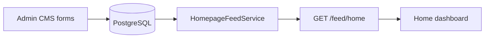

# ADR-010 — Homepage Metadata Architecture

**Status:** Accepted  
**Date:** 2026-07  
**Scope:** Feed + CMS

## Problem

The home feed must surface curated meets and series without hard-coding IDs. Editors need tags and priority from CMS forms; learners need consistent rows (featured, trending, competency-based) from one service.

## Decision

Store **homepage metadata on content models**:

- `KnowledgeMeet.homepageTags` (`String[]`), `displayPriority` (`Int`, default 100)
- `KnowledgeSeries.homepageTags`, `displayPriority`
- Constants/helpers: `homepage-tags.constant.ts` (API), CMS fields `CmsMetadataFields` (web)

**Feed composition:**

- `HomepageFeedService` (`apps/api/src/modules/feed/`) powers `GET /feed/home`, `GET /feed/dashboard`, `GET /feed/recommendations`, `GET /feed/related/:contentType/:id`, `GET /explore`.
- **Admin:** `GET/PUT /admin/cms/homepage` and `HomepageSection` model for section config; learner layout also reads `GET /homepage/layout` and `GET /platform/settings` (`platform.controller.ts`).

## Alternatives considered

| Alternative | Why not chosen |
|-------------|----------------|
| Homepage IDs only in localStorage | Not shareable across admins; partial UI still on builder page |
| Separate homepage_items table only | Duplicates meet/series metadata already on content |
| Client-only curation | No single source of truth |

## Tradeoffs

- **Pros:** Tags travel with content; reindex/search stay aligned with published records.
- **Cons:** `/admin/homepage-builder` may still use localStorage for some section UI — technical debt to unify with `HomepageSection`.

## Future impact

- Complete migration of homepage builder to `PUT /admin/cms/homepage`.
- Document tag vocabulary in CMS tooltips; validate allowed tags in DTO if needed.

## Traceability

| Layer | Location |
|-------|----------|
| Prisma | `KnowledgeMeet`, `KnowledgeSeries`, `HomepageSection` |
| API | `feed/homepage-feed.service.ts`, `admin-cms.controller.ts` |
| Docs | `architecture/homepage-flow.md`, `docs/data-model.md` |
