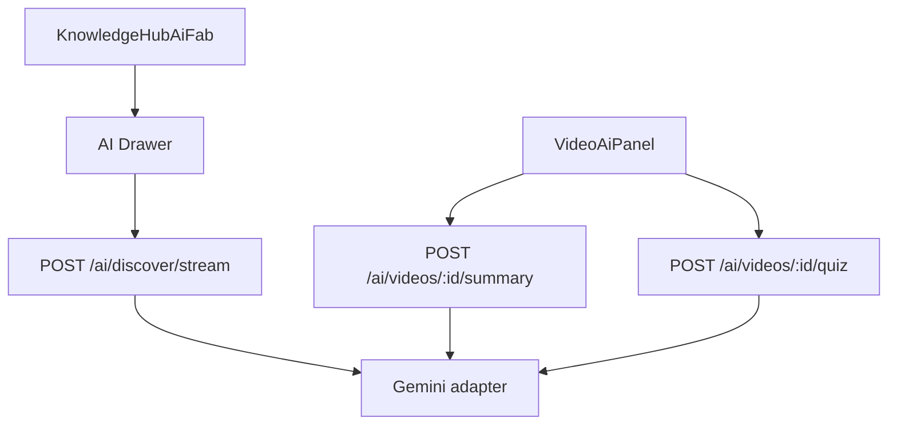

# KnowledgeHub AI Flow

## Preconditions

- `GET /ai/status` — client enables UI when provider configured.
- `GEMINI_API_KEY` on API; `AI_PROVIDER=gemini`.
- If missing: noop provider, UI shows unavailable (`useAiStatus`).

## Streaming

- `POST /ai/discover/stream` — SSE/streaming response for chat-style discover.
- Errors must not leak API keys; client handles abort/retry in feature hooks.

## Performance

- AI FAB and drawer **dynamically imported** in app layout (2026-07-20).
- `useAiStatus(enabled)` only when drawer opens.

Code: `apps/api/src/modules/ai/`, `apps/web/src/features/ai/`.

Setup: `docs/gemini-setup.md`. ADR: `adr/ADR-009-why-gemini-ai.md`.
