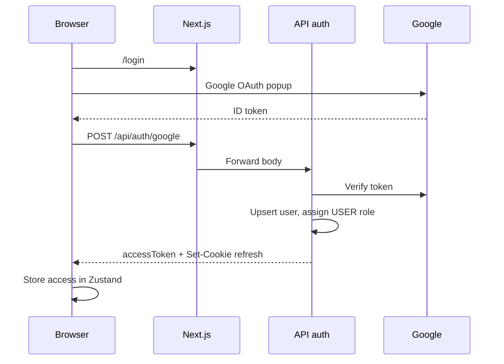

# Authentication Flow

## Rules

- Email domain enforced: `ALLOWED_EMAIL_DOMAIN` (default `tothenew.com`).
- New users: **USER** role only; TEAM/ADMIN assigned at `/admin/users`.
- Refresh: `POST /auth/refresh` reads httpOnly cookie; returns new access token.
- Logout: `POST /auth/logout` revokes refresh server-side.

## Web integration

- `GoogleAuthProvider`, `AuthProvider` wrap the app.
- `fetchApi` adds `Authorization` header from auth store.

## Security

- JWT secrets ≥ 32 chars (`JWT_ACCESS_SECRET`, `JWT_REFRESH_SECRET`).
- Never log tokens or cookies.

See `docs/security-guide.md`, `architecture/authorization-flow.md`.
