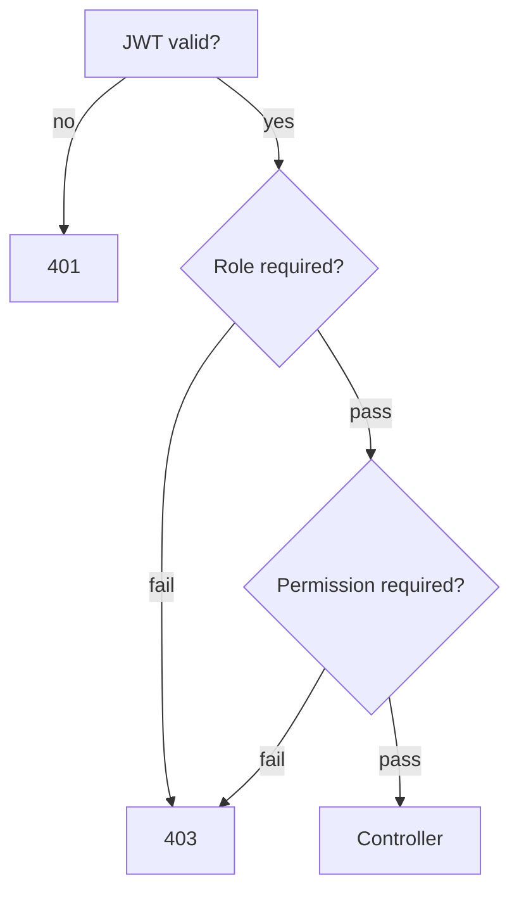

# Authorization Flow

## Model

RBAC with three roles (`RoleName` in `packages/types`):

| Role | Typical capabilities |
|------|----------------------|
| `USER` | Browse, watch, engage |
| `TEAM` | Upload, studio, team meet/series slots |
| `ADMIN` | CMS, approvals, users, analytics |

Fine-grained **permissions** (e.g. `content:approve`, `users:manage`) live in DB and are seeded in `seed.ts`.

## Nest guards

1. `JwtAuthGuard` — global default; `@Public()` skips.
2. `RolesGuard` + `@Roles(RoleName.ADMIN)` on admin controllers.
3. `PermissionsGuard` + `@Permissions('content:approve')` where needed.

## Web enforcement

- `ProtectedRoute` — requires authentication.
- Admin routes check `ADMIN` (and sometimes TEAM) in layout or page wrappers.
- API remains source of truth — never rely on UI hiding alone.

Matrix: `docs/roles-and-permissions.md`.
