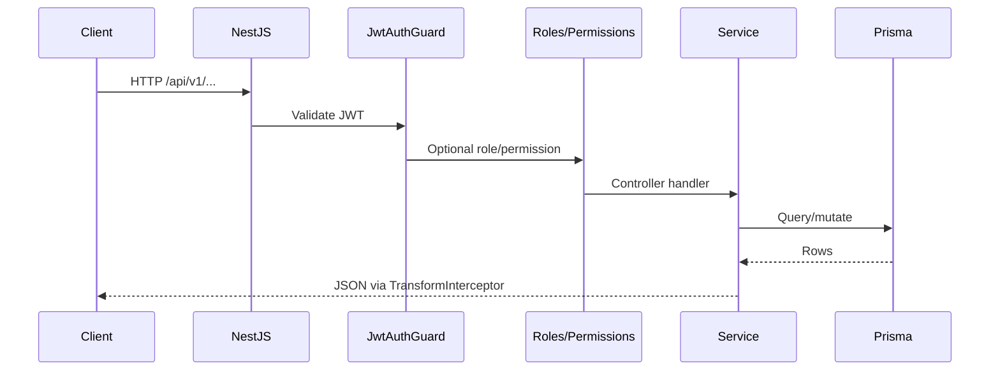

# Backend Flow

## Request pipeline

## Bootstrap

- `main.ts`: helmet, CORS (`CORS_ORIGIN`), cookie parser, global prefix `api/v1`, validation pipe, exception filter, transform interceptor.
- `app.module.ts`: imports all feature modules.

## Module map

| Module | Responsibility |
|--------|----------------|
| `auth` | Google, JWT, refresh, logout, me |
| `users` | Profile, admin user list, roles |
| `videos` | Catalog, playback, stream, submit |
| `knowledge-meets` | Published meets |
| `knowledge-series` | Published series |
| `engagement` | Comments, bookmarks, history |
| `feed` | Home, dashboard, recommendations, explore |
| `search` | FTS / Elasticsearch |
| `progress` | Summary, weekly activity, playback prefs |
| `qa` | Questions, answers, votes |
| `resources` | Video attachments |
| `studio` | Drafts, publish |
| `admin` | Approvals, analytics, announcements |
| `admin-cms` | CMS CRUD, homepage, settings |
| `notifications`, `push`, `mail`, `jobs` | Comms and reminders |
| `ai` | Gemini discover, summary, quiz |
| `storage` | Upload presign/complete |
| `taxonomy` | Competencies, categories |

## Public vs protected

- `@Public()` on auth endpoints and some taxonomy/health routes.
- Default: all routes require valid JWT unless marked public.

Details: `docs/backend-architecture.md`, `docs/api-contract.md`.
