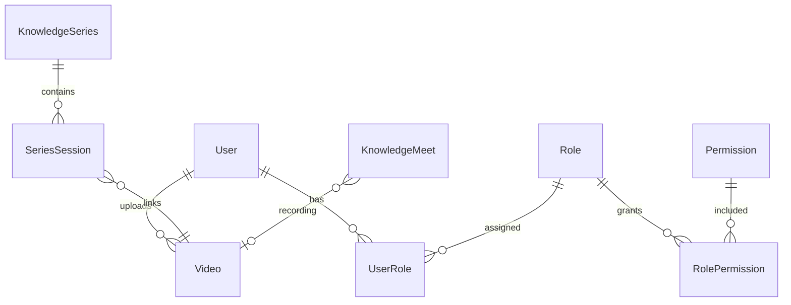

# Database Flow

## Access pattern

- All persistence goes through **Prisma Client** in Nest services/repositories.
- Migrations: `apps/api/prisma/migrations/` — apply with `pnpm db:migrate` (dev) or `db:migrate:deploy` (prod).
- Seed: `apps/api/prisma/seed.ts` — roles, permissions, sample content (login still via Google).

## Content lifecycle

1. **Create** — DRAFT on video/series; meet uses `MeetStatus` + recording URL.
2. **Submit** — Video `POST /videos/:id/submit` → `PENDING_APPROVAL`.
3. **Approve** — Admin `POST /admin/approvals/:id/approve` → `PUBLISHED`, search index updated.
4. **Soft delete** — `deletedAt` on several content models where applicable.

## Search indexing

- Postgres: FTS vectors (migration `20260718131500_add_fts_search`).
- Elasticsearch: optional adapter when `SEARCH_PROVIDER=elasticsearch`.

## Orphan schema note

`LearningPath` / `LearningPathItem` exist in Prisma but have no active API/UI — do not use in new features without product approval.

Full entity reference: `docs/database-design.md`, `docs/data-model.md`.
