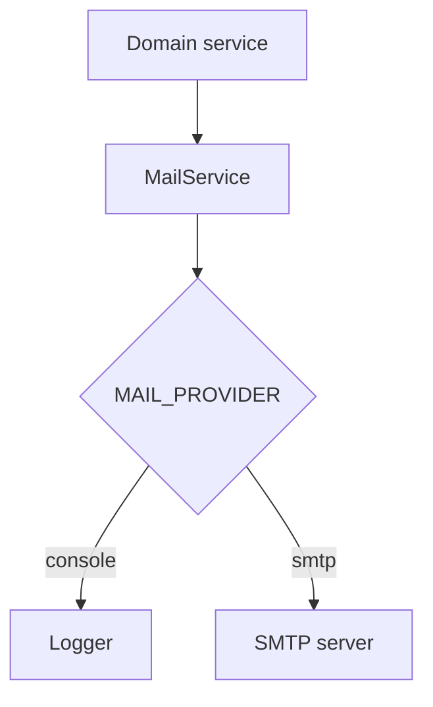

# Email Flow

Email is sent through the **mail adapter** (`MAIL_PROVIDER`).

| Provider | Use case |
|----------|----------|
| `console` | Local dev — logs message, no delivery |
| `smtp` | Production — nodemailer with `SMTP_*` env vars |

## Triggers (implemented in services/jobs)

- Video approval approved/rejected → uploader notified (when mail configured).
- Meet published → optional email path alongside in-app notification.
- Meet reminder cron exists but **disabled** for recorded-meet product model.

Configuration: `apps/api/src/config/configuration.ts`, `.env.example`.

Never log SMTP passwords. See `docs/security-guide.md`.
