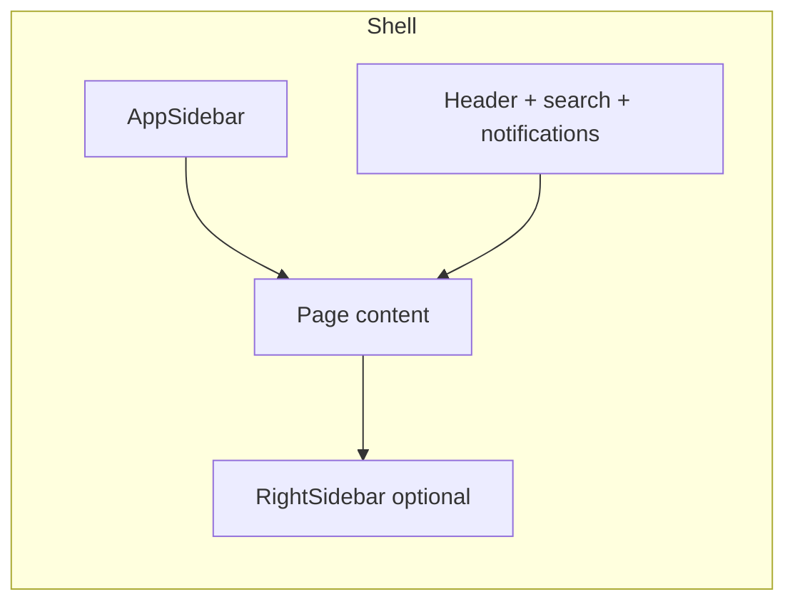

# Frontend Flow

## Runtime

1. User opens `http://localhost:3000` → Next.js App Router.
2. Unauthenticated users hitting `(app)` routes are redirected by `ProtectedRoute` to `/login`.
3. Login uses `@react-oauth/google` → `POST /api/auth/google` (rewritten to Nest).
4. Access token stored in Zustand (`auth` store); refresh via cookie on `/auth/refresh`.

## Layout

- **Global client layout:** `apps/web/src/app/(app)/layout.tsx` — providers, mini player (dynamic), AI FAB (dynamic).
- **Styling:** Aspire theme `knowledgehub.scss` (`kh-*` scoped classes).

## Data fetching

- `fetchApi` / `fetchApiJson` (`apps/web/src/lib/api.ts`) attach `Authorization: Bearer`.
- React Query hooks per domain (`apps/web/src/hooks/`).
- Next rewrites: `/api/*` → `NEXT_PUBLIC_API_URL`.

## Route groups

| Group | Path prefix | Audience |
|-------|-------------|----------|
| Auth | `(auth)/login` | Public |
| Learner | `/`, `/explore`, `/watch`, `/series`, `/meets`, `/library`, `/search`, `/speakers` | Authenticated |
| Team | `/team/*` | TEAM + ADMIN |
| Admin | `/admin/*` | ADMIN |

See `docs/ui-flow.md` for journeys and `docs/frontend-architecture.md` for folder conventions.
