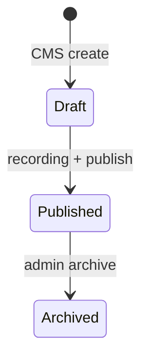

# Knowledge Meet Flow

Meets are **recorded sessions** (product pivot from live events). Learners browse library; admins manage metadata and recording URLs.

## Learner

1. `GET /knowledge-meets` — list (filters via query params in service).
2. `/meets` → `/meets/[id]` — detail, watch via linked `Video` or `recordingUrl`.
3. Engagement: comments (if enabled), feedback schema, bookmarks.

## Admin / team

1. Create meet in CMS with speaker, competency, tags, `homepageTags`, `displayPriority`.
2. Attach recording: `recordingUrl` and/or link `videoId`.
3. Publish workflow may notify users (`MEET_PUBLISHED`); cron reminders for live events are **disabled** (columns retained on model).

API: `knowledge-meets` (read), `admin-cms` (write), `team-meets` (contributor recording).

Web: `features/admin-cms/meets/`, `app/(app)/meets/`.
