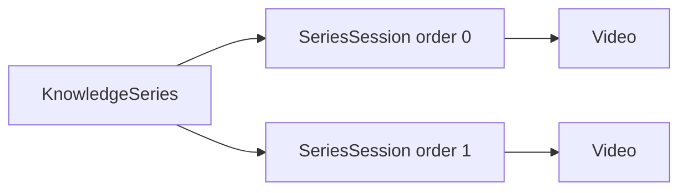

# Knowledge Series Flow

Series group ordered **episodes** (`SeriesSession`) that reference `Video` records or external playback metadata.

## Learner

1. `GET /knowledge-series` — catalog.
2. `/series/[id]` — episode list, progress via history on each video.
3. Watch navigates to `/watch/[videoId]` with series context for autoplay (`UserPlaybackPreference.autoPlayNext`).

## Admin

1. Create series — `POST admin/cms/series`.
2. Add episodes — `POST admin/cms/series/:seriesId/episodes`, reorder `PUT .../reorder`.
3. Team may upload into fixed `orderIndex` via `team/series`.

Status: `ContentStatus` on series (`DRAFT` → `PUBLISHED`). Videos may go through approval independently.

Web: `features/admin-cms/series/`, `app/(app)/series/`.
