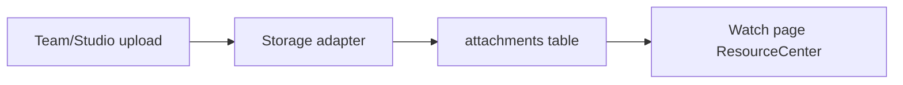

# Media Management Flow

## Storage adapter

`STORAGE_PROVIDER`:

| Value | Behavior |
|-------|----------|
| `LOCAL` | Files under `STORAGE_LOCAL_PATH`; served via `/uploads` rewrite |
| `S3` | Presigned upload; `storageKey` on `Video` / `Attachment` |

## Upload API (`/uploads`)

1. `POST /uploads/presign` — client upload intent.
2. `POST /uploads/file` — direct multipart (local dev).
3. `POST /uploads/complete` — finalize attachment record.

## Playback

| Mode | Path |
|------|------|
| Self-hosted file | `GET /videos/:id/playback` metadata, `GET /videos/:id/stream` with **HTTP Range** |
| External URL | `videoUrl` / embed handled in `VideoPlayer` |
| Meet recording | `recordingUrl` or linked `Video` |

## Attachments

- `Attachment` model — linked to `Video` or `KnowledgeMeet`, optional `externalUrl`, `resourceKind`.
- Resource center: `GET/POST /videos/:videoId/resources`.

See `docs/architecture/storage.md` for storage module detail.
