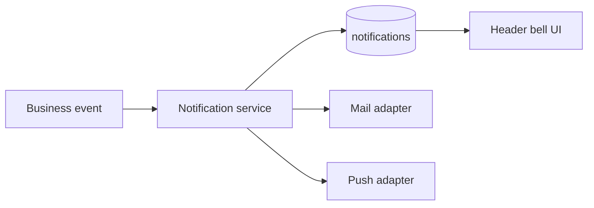

# Notification Flow

## In-app

1. Server creates `Notification` rows (approval, meet published, etc.).
2. Client polls `GET /notifications/unread-count` (~60s).
3. Full list `GET /notifications` loads **when user opens bell** (perf optimization 2026-07-20).
4. `PATCH /notifications/:id/read`, `POST /notifications/read-all`.

Component: `components/layout/NotificationBell.tsx`.

## Push (optional)

- `GET /push/vapid-public-key`
- `POST /push/subscribe` / `DELETE /push/subscribe`
- `PUSH_PROVIDER=webpush` + VAPID env in production.

## Email (optional)

- `MAIL_PROVIDER=smtp` for approval and publish emails.
- Dev: `console` provider logs only.

Module: `apps/api/src/modules/notifications/`.
