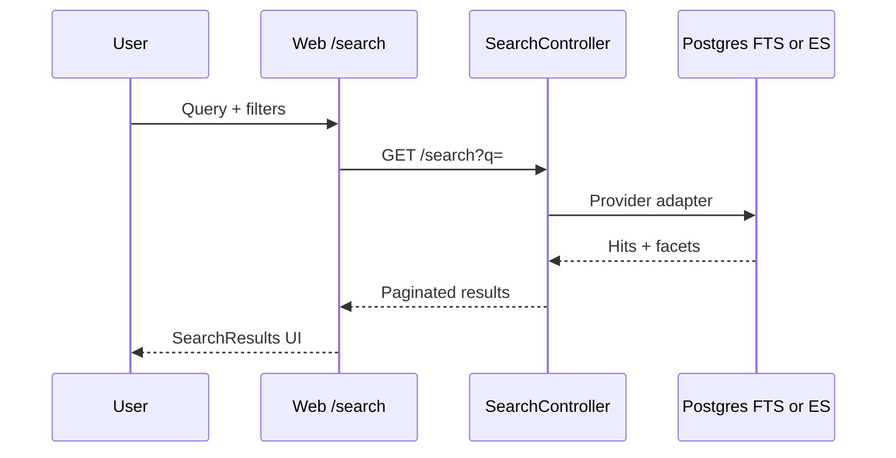

# Search Flow

## Provider selection

- `SEARCH_PROVIDER=postgres` (default) — Prisma + `search_vector` GIN indexes.
- `SEARCH_PROVIDER=elasticsearch` — `ELASTICSEARCH_URL`, reindex via `POST /admin/search/reindex`.

## Endpoints

| Method | Path | Purpose |
|--------|------|---------|
| GET | `/search` | Main query |
| GET | `/search/suggestions` | Autocomplete |
| GET | `/search/recent` | User recent queries |
| GET | `/search/popular` | Popular terms |
| GET | `/search/trending` | Trending terms |

## UI

- `/search` page — `SearchResults`, `SearchDiscovery`
- Header — `HeaderSearch` quick search
- Admin — `/admin/search-analytics` via `GET /admin/search/analytics`

Logging: `SearchQueryLog` model for analytics.
