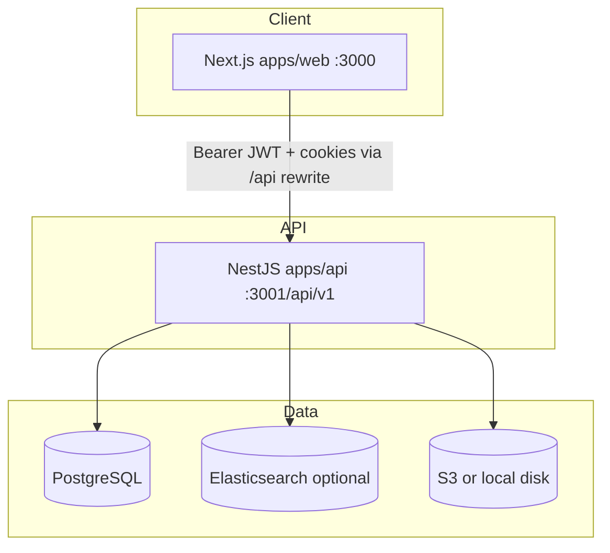

# System Overview

KnowledgeHub is an internal learning platform for **TO THE NEW** (`@tothenew.com`). A pnpm monorepo delivers a Next.js web app and a NestJS API over PostgreSQL, with optional Elasticsearch, S3, SMTP, and Web Push.

## Logical architecture

## Packages

| Path | Role |
|------|------|
| `apps/web` | Learner, team, and admin UI |
| `apps/api` | REST API, auth, business logic |
| `packages/types` | Shared enums and DTO contracts |
| `packages/tsconfig` | Shared TypeScript configs |
| `docker/docker-compose.yml` | Postgres 16 + Elasticsearch 8.15 |

## Cross-cutting concerns

- **Auth:** Google OAuth → JWT access + httpOnly refresh (`auth` module).
- **Authorization:** `USER`, `TEAM`, `ADMIN` + permission slugs (`roles-and-permissions`).
- **Adapters:** Storage, search, mail, push, AI selected by environment variables.
- **Observability:** Health at `GET /health`; Swagger at `/api/v1/docs` (dev).

## Related documentation

| Document | Purpose |
|----------|---------|
| `docs/architecture.md` | Monorepo and module map |
| `docs/project-overview.md` | Business context |
| `adr/` | Architecture decision records |
| `docs/architecture/phase-*.md` | Historical phase deliverables |
