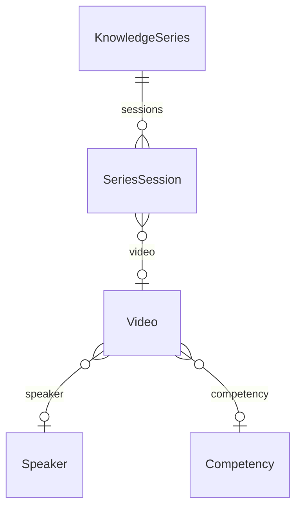

# Data Model

Narrative companion to `docs/database-design.md` and Prisma schema.

## Core relationships

- **User** uploads **Video**, creates **KnowledgeMeet** / **KnowledgeSeries**.
- **Speaker** and **Competency** classify videos, meets, series.
- **KnowledgeSeries** contains **SeriesSession** rows pointing to **Video**.
- **KnowledgeMeet** may link one **Video** as recording (`videoId` unique).

## Engagement polymorphism

`Comment`, `Bookmark`, `History` use `ContentType` enum (`VIDEO`, `KNOWLEDGE_MEET`, `KNOWLEDGE_SERIES`) + `contentId` UUID.

## Content status

Videos and series: `DRAFT` → `PENDING_APPROVAL` → `PUBLISHED` → `ARCHIVED`.

Meets: `MeetStatus` (`UPCOMING`, `COMPLETED`, `CANCELLED`) — UX emphasizes completed recordings.

## Homepage metadata

`homepageTags: String[]` and `displayPriority: Int` on meets and series feed `HomepageFeedService`.

## Settings

`PlatformSetting` single row `id=default` with JSON `data` for feature flags and copy.

