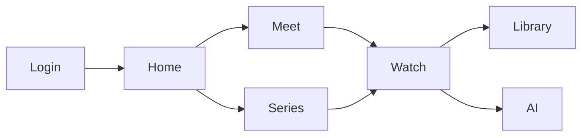

# UI Flow — KnowledgeHub

## Learner flow (assessment diagram)

```
Guest
  ↓
Google Login          (/login → POST /api/auth/google)
  ↓
Homepage              (/, feed/dashboard)
  ↓
Knowledge Meet        (/meets → /meets/[id])
  ↓
Video                 (/watch/[id])
  ↓
Bookmark              (bookmark control → POST /bookmarks)
  ↓
Learning Journey      (/library, continue watching, progress summary)
  ↓
KnowledgeHub AI       (FAB / drawer → /ai/* when configured)
```

Parallel paths: **Explore** (`/explore`), **Search** (`/search`), **Knowledge Series** (`/series/[id]` → watch episode video).

## Admin flow

```
Admin (ADMIN role)
  ↓
Dashboard             (/admin)
  ↓
Content Manager       (/admin/content)
  ↓
Knowledge Meets       (/admin/meets/*)
  ↓
Knowledge Series      (/admin/series/*, episodes)
  ↓
Resources             (/admin/resources/*)
  ↓
Publish               (approvals / CMS status, recording URL)
  ↓
Homepage              (/admin/homepage-builder, PUT /admin/cms/homepage)
```

Also: **Users** (`/admin/users`), **Analytics** (`/admin/analytics`), **Platform** (`/admin/platform`).

## Team flow

`/team/upload` → `/team/studio` → submit for approval → `/admin/approvals`.

## Route reference

| Area | Paths |
|------|--------|
| Auth | `/login` |
| Learner | `/`, `/explore`, `/search`, `/watch/[id]`, `/meets`, `/series`, `/library`, `/speakers` |
| Team | `/team/upload`, `/team/studio`, `/team/series-upload`, `/team/meet-upload` |
| Admin | `/admin/*` |



Implementation: `apps/web/src/app/(app)/`, `features/admin-cms/`.
